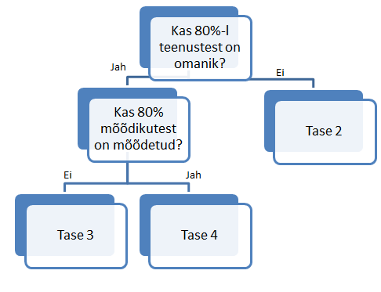

##Sissejuhatus

```{r, echo=FALSE, warning=FALSE, message=FALSE}
#funktsioon laiast formaadist pikaks tegemiseks
meltimine=function(kanal, data) {
  library(reshape2)
  #leiame ainult seda kanalit puudutavad muutujad
  sub=data[, grepl(paste(kanal, "|identifikaator|ministeerium|allasutus|tegevusvaldkond|teenusetyyp|makse", sep=""), names(data))]
  #määran id-d, mis meltimisel meltimata jäävad
  id=grep(c("identifikaator|ministeerium|allasutus|tegevusvaldkond|teenusetyyp|makse|link"), names(sub), value=T)
  #kui selle kanali kohta stati pole, anna vastuseks null
  if(length(id)<7) {
    tulem=NULL
  } else {
    #meldime andmed kitsaks
    tulem=melt(sub, id=id)
    #muudan variable nime ära, mis on kanalispets, muidu ei saa rbindida
    names(tulem)=c("identifikaator", "tegevusvaldkond", "tyyp", "ministeerium", "allasutus",  
                   "makse", "link",  "variable",           
                   "value")
  }
  tulem
}

#abifunktsioon andmete sisse lugemiseks
korrastaja=function(andmed, eemalda) {
  library(reshape2)
  #eemalda - mis osa columnite nimedest tuleb eemdalda
  names(andmed)=gsub(pattern=eemalda,"" ,names(andmed))
  #kanalite lõikes meldime
  veeb=meltimine("Veebileht / portaal.", data=andmed)
  iseteen=meltimine("E-iseteenindus.", data=andmed)
  eesti=meltimine("Eesti.ee.", data=andmed)
  nuti=meltimine("Nutirakendus.", data=andmed)
  digitv=meltimine("Digitelevisioon.", data=andmed)
  epost=meltimine("E-post.", data=andmed)
  sms=meltimine("Tekstisõnum.", data=andmed)
  telefon=meltimine("Telefon.", data=andmed)
  faks=meltimine("Faks.", data=andmed)
  post=meltimine("Post.", data=andmed)
  lett=meltimine("Letiteenus büroos.", data=andmed) #võib muutuda! vaja ka gsubi siis lisada
  kodus=meltimine("Kliendi juures.", data=andmed)
  #rbindime
  koos=rbind(veeb, iseteen, eesti, nuti, digitv, epost, sms, telefon, faks, 
             post, lett, kodus)
  #leiame kanali ja näitaja
  #kanal <- strsplit(as.character(koos$variable), split ="\\.\\w{1,}$")
  #stati saamiseks eemaldame punktid kanali nimedest
  koos$variable=gsub(".ee.", ".", as.character(koos$variable), fixed=T)
  koos$variable=gsub("Letiteenus büroos", "Letiteenus", as.character(koos$variable), fixed=T)
  koos$variable=gsub("E-iseteenindus", "Eiseteenindus", as.character(koos$variable), fixed=T)
  koos$variable=gsub("E-post", "Epost", as.character(koos$variable), fixed=T)
  koos$variable=gsub("Veebileht / portaal", "Veebileht", as.character(koos$variable), fixed=T)
  stat=gsub("Kliendi juures", "Kliendijuures", as.character(koos$variable), fixed=T)
  
  #lõikame punktini asja maha
  stat <- strsplit(stat, split ="\\.")
  #teeme df-ks
  df=as.data.frame(stat)
  #transponeerime
  df=as.data.frame(t(df))
  #lisame algsesse andmestikku
  koos$kanal=df[,1]
  koos$naitaja=df[,2]
  #viskame välja tühjad read, kus pole linki
  koos=koos[!is.na(koos$link),]
  koos
} 
#andmete download
andmedSisse=function() {
   #loeme andmed sisse
  library(jsonlite)
  library(data.table)
  andmed=fromJSON(readLines("https://www.riigiteenused.ee/api/et/all"), flatten=T)
  andmed=andmed["teenuste_kanalid_ja_moodikud"!="list()"]
  andmedMoodik <- rbindlist(lapply(andmed[["teenuste_kanalid_ja_moodikud"]], function(x) {
    as.list(unlist(x))
  }), fill=TRUE)
  
  andmed
}

#andmed pikaks
DataLong2=function(andmedLai) {
   vars=names(andmedLai) %in% c("regulatsioon", "objectId", "eluarisyndmus", "kirjeldus", 
                               "eeltingimus", "jareltingimus", "createdAt", 
                               "updatedAt", "keel", "osakondyksus", "omanikunimi", 
                               "omanikutelefon","omanikuemail", 
                               "konfinfo", "seotuddokumendid", "seisund", 
                               "muudatustvajav", "aegumisekpv", "funktsioon", 
                               "veebiaadress")
  #eemaldame muutujad
  andmedLai=andmedLai[,!vars]
  #aastate põhjal teeme andmed 2-ks (kui aastaid rohkem siis vastavalt sellele
  #arv muutub)
  andmedLai2014=andmedLai[, !grepl("empty.|2011.", names(andmedLai))]
  andmedLai2011=andmedLai[, !grepl("empty.|2014.", names(andmedLai))]
  andmedLaiEmpty=andmedLai[, !grepl(".2014.|2011.", names(andmedLai))]
  puhas2014=korrastaja(andmedLai2014, "2014.")
  puhasEmpty=korrastaja(andmedLaiEmpty, "empty.")
  puhas2011=korrastaja(andmedLai2011, "2011.")
  #paneme andme kokku
  andmedPikk=rbind(puhas2014, puhas2011,puhasEmpty)
  return(andmedPikk)
}
andmedLai=andmedSisse()
andmedPikk=DataLong2(andmedLai)
#teeme valued numericuks
andmedPikk$value=as.numeric(as.character(andmedPikk$value))
#andmete kuupäev
kell=Sys.time() 
```


Käesolev artikkel üritab numbriliselt näidata, milline on Eesti avaliku sektori asutuste teenuste juhtimise küpsustase. Kuna [projekt](https://github.com/MKM-ITAO/riigiteenused "https://github.com/MKM-ITAO/riigiteenused") alles käib, on tulemused poolikud ning põhjapanevate järelduste tegemine jääb 2016. aasta märtsi, kui peaks kõik teenused olema kaardistatud. Analüüsitavad andmed tõmmati veebist seisuga `r kell `. 

##Teenuste juhtimise küpsustasemest

Teenuste küpsustasemetest räägib ["Teenuste portfellijuhtimise uuring"](https://www.mkm.ee/sites/default/files/avalike_teenuste_uhtne_portfellijuhtimine.pdf "https://www.mkm.ee/sites/default/files/avalike_teenuste_uhtne_portfellijuhtimine.pdf") lehekülg 11. Teenuse juhtimise küpsusmudel aitab hinata, mis tasemel asutus teenuseid juhib ning aitab ka disainida meetmeid, kuidas asutusi mõjutada küpsustaset tõstma.Üldjoontes on tasemed järgmised:

- __1. Funktsioon__ (teenuste kirjeldamine puudub, täidetakse ainult seadusest tulenevaid funktsioone),

- __2. Teenuste loend__ (eksisteerib teenuste loend, nagu näiteks [siin](https://www.mkm.ee/et/teenuste-otsing "https://www.mkm.ee/et/teenuste-otsing")),

- __3.  Kirjeldatud teenus__ (teenuse info on korrastatud, teenusel on omanik),

- __4. Mõõdetud teenus__ (teenusel on mõõdik, teenuse kohta tehakse analüüsi),

- __5. Optimeeritud teenus__ (toimub teenuste teadlik ja pidev parendamine, teenused on seostatud riigi strateegilise juhtimise mõõdikutega)

##Hetkeolukord

Hetkeolukorra hindamiseks kasutan riigiteenuste projekti andmeid (masinloetaval kujul kättesaadavad [siin](https://www.riigiteenused.ee/api/et/all "https://www.riigiteenused.ee/api/et/all")).

Protsess küpsustaseme arvutamiseks on lihtne ning kujutatud järgneval joonisel: 



Kui kõikidel teenustel on omanik (lahter omaniku nimi või omaniku amet või omaniku e-maili aadress või telefon on täidetud, võib vaielda, kas ainult telefonist või ameti nimetusest piisab, kuid eeldame, et see viitab tõsiasjale, et omanik on olemas), on asutuse teenuste juhtimise küpsustase 3 (kirjeldatud teenus), vastasel juhul 2 (teenuse loend). Kui juhtimise küspsustase on 3, siis kontrollime, kas 80%-i mõõdikute väärtus on mõõdetud. Juhul, kui on, on teenuse juhtimise tase 4 (mõõdetud teenus), kui ei ole, on tase endiselt 3.

80% reegel on võetud ärimaailmas käibes olevast 80/20 põhimõttest. 100%-lise täitmise seadmine on ebamõistlik, kuna marginaalsete teenuste puhul on omanike puudumine või mõõdikute mittemõõtmine ebaoluline. Põhirõhk peab olema olulistel (suurimat väärtust loovatel) teenustel. Lisaks võib mõõdikute puudumine/omaniku puudumine olla seotud ümberkorraldustega teenuste/asutuse juhtimisel.

##Tulemused

Ministeeriumite lõikes on teenuste juhtimise küpsustasemed järgnevad:

Vaatame kõige pealt, mis on ministeeriumite haldusalade teenuste juhtimise küpsustase:
```{r, cache=TRUE, warning=FALSE, echo=F}
#funktsioon ministeeriumi lõikes küpsuse arvutamiseks
KupsusTaseMin=function(andmedPikk, andmedLai) {
  #muutujad, mida vajame
  var=c("ministeerium", "omanikunimi", "omanikuamet" ,
        "omanikutelefon", "omanikuemail")
  andmedLaiSub=andmedLai[,var]
  #teeme uue colmni, kuhu paneme väärtuse 1 kui on omanik (e-mail või 
  #telefon või nimi)
  andmedLaiSub$OnOmanik=ifelse(andmedLaiSub$omanikunimi==""&
                                 andmedLaiSub$omanikuamet==""&
                                 andmedLaiSub$omanikuemail==""&
                                 andmedLaiSub$omanikutelefon=="", 0, 1)
  #kupsus teenuste omanike olemasolu mõistes
  library(dplyr)
  OmanikMinLoikes=andmedLaiSub%>%
    group_by(ministeerium)%>%
    summarise(omanikOsakaal = mean(OnOmanik),
              teenusteArv=length(OnOmanik))%>%
    mutate(kupsus=ifelse(omanikOsakaal>=0.8, 3, 2)) 
  #võtame välja, kus tase 3 olemas
  tase3=OmanikMinLoikes$ministeerium[OmanikMinLoikes$kupsus==3]
  andmedPikkSub=andmedPikk[andmedPikk$ministeerium %in% tase3, ]
  #äkki on neil kõrgem tase e 80% teenuste igal kanalil on mõõdik olemas
  moodikMinLoikes=andmedPikkSub %>%
    group_by(ministeerium) %>%
    summarise(onMoodik=sum(!is.na(value)), 
              moodikArv=n(),
              moodikOsakaal=onMoodik/moodikArv)%>%
    mutate(kupsus=ifelse(moodikOsakaal>=0.8, 4, 3))
  #paneme andmed kokku ja näitame välja
  OmanikMinLoikes[OmanikMinLoikes$kupsus==3,]$kupsus=
    moodikMinLoikes$kupsus
  #paneme ministeeriumite kaupa järjekorda
  OmanikMinLoikes[order(OmanikMinLoikes$ministeerium, 
                           OmanikMinLoikes$ministeerium),
                     c("ministeerium", "teenusteArv","kupsus")]
}
OmanikMinLoikes=KupsusTaseMin(andmedPikk, andmedLai)
names(OmanikMinLoikes)=c("Ministeerium", "Teenuste arv", "Küpsustase")
kable(OmanikMinLoikes)
```

Nagu näha on mõni üksik ministeerium tasemel 3, enamiku teenuste juhtimise küpsustase jääb 2. tasemele.

Vaatame, kas asutuste lõikes on olukord erinev.
```{r, cache=TRUE, warning=FALSE, echo=FALSE}
KupsusTaseAsutus=function(andmedPikk, andmedLai) {
  #muutujad, mida vajame
  var=c("ministeerium", "allasutus", "omanikunimi", "omanikuamet" ,
        "omanikutelefon", "omanikuemail")
  andmedLaiSub=andmedLai[,var]
  #teeme uue colmni, kuhu paneme väärtuse 1 kui on omanik (e-mail või 
  #telefon või nimi)
  andmedLaiSub$OnOmanik=ifelse(andmedLaiSub$omanikunimi==""&
                                 andmedLaiSub$omanikuamet==""&
                                 andmedLaiSub$omanikuemail==""&
                                 andmedLaiSub$omanikutelefon=="", 0, 1)
  #kupsus teenuste omanike olemasolu mõistes
  library(dplyr)
  OmanikAsutusLoikes=andmedLaiSub%>%
    group_by(ministeerium, allasutus)%>% 
    summarise(omanikOsakaal = mean(OnOmanik),
              teenusteArv=length(OnOmanik))%>%
    mutate(kupsus=ifelse(omanikOsakaal>=0.8, 3, 2)) 
  #võtame välja, kus tase 3 olemas
  tase3=OmanikAsutusLoikes$allasutus[OmanikAsutusLoikes$kupsus==3]
  #äkki on neil kõrgem tase e 80% teenuste igal kanalil on mõõdik olemas
  andmedPikkSub=andmedPikk[andmedPikk$allasutus %in% tase3, ]
  moodikAsutusLoikes=andmedPikkSub %>%
    group_by(ministeerium,allasutus) %>%
    summarise(onMoodik=sum(!is.na(value)),
              moodikArv=n(),
              moodikOsakaal=onMoodik/moodikArv)%>%
    mutate(kupsus=ifelse(moodikOsakaal>=0.8, 4, 3))
  #paneme andmed kokku ja näitame välja
  OmanikAsutusLoikes[OmanikAsutusLoikes$kupsus==3,]$kupsus=
    moodikAsutusLoikes$kupsus
  #paneme ministeeriumite kaupa järjekorda
  OmanikAsutusLoikes[order(OmanikAsutusLoikes$ministeerium, 
                           OmanikAsutusLoikes$allasutus),
                c("ministeerium", "allasutus", "teenusteArv","kupsus")]
}
OmanikAsutLoikes=KupsusTaseAsutus(andmedPikk, andmedLai)
names(OmanikAsutLoikes)=c("Ministeerium", "Allasutus", "Teenuste arv", "Küpsustase")
kable(OmanikAsutLoikes)
```

Nagu näha võib näha mitmeid asutusi, kes teenuste juhtimine on tasemel 3. Samas tuleb hetkel olla tulemuste suhtes kriitiline, kuna paljudes asutustes on enamik teenuseid kirjeldamata. Kõikide teenuste kirjeldamisel saab adekvaatsema ülevaate, mis teenuste küpsustase. Kui sind huvitab selle artikli tulemuste saamiseks kasutatav R-i kood, kliki siia. 